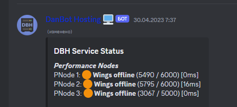

  

<h3 align="center">💥 Pterodactyl Crasher</h3>
<h3 align="center">Проект закрыт, мне нечего больше дорабатывать. Если хотите, пишите мне в дискорд за доработками - fiuimwix. Код рабочий, но проект больше не поддерживается.</h3>

---

  
   
  <em>Пример работы</em>

---

💣 Pterodactyl Crasher — это мощный инструмент, предназначенный для борьбы с некачественными серверами Pterodactyl. Эта программа позволяет имитировать ситуации, при которых происходит перераспределение ресурсов (Runtime Allocation Call), что может привести к сбою узла. Разработанный для использования в обучающих и исследовательских целях, Pterodactyl Crasher помогает администраторам и разработчикам понять и устранять потенциальные уязвимости, а также вредить ненадежным хостингам.
      

## 📝 Обзор

- [📝 Обзор](#-обзор)
- [🧐 О проекте ](#-о-проекте-)
- [🏁 Итак, начнем ](#-итак-начнем-)
  - [Установка](#установка)
- [⛏️ Языки программирования ](#️-языки-программирования-)
- [✍️ Авторы ](#️-авторы-)
 

## 🧐 О проекте 

Pterodactyl Crasher — это инструмент, который поможет вам отомстить недобросовестным провайдерам хостинга. Он создает большие файлы и генерирует нагрузку, что в итоге создает нагрузку на сервер. Этот метод также называется Runtime Allocation Call. Однако за последствия от использования несете ответственность вы..

## 🏁 Итак, начнем 

Сначала выбираем язык программирования, который вам нужен: у нас есть Java, Python, JavaScript. Выберите подходящий. Смотрите раздел [Установку](#установка), чтобы узнать, как запустить его на хостинге. 

### Установка

Заливайте файлы: если используете JS, то два файла; если Python, то один и так далее. Просто запустите файл! Не забудьте, что названия могут быть разными в стартовой команде и исходном файле.

## ⛏️ Языки программирования 
Наш скрипт доступен на таких языках программирования, как:

- Python
- JavaScript
- Java
- Rust
- Lua

## ✍️ Авторы 

- [@xdearboy](https://github.com/xdearboy/) - Разработал скрипты. Javascript + Python.
- [@noxcel](https://github.com/Nocxell) - Подал мне идею, Java.
- [@vladdis](https://discord.com/invite/k-protect-community-public-925337010779078676) - Rust + Python скрипт для его запуска.
- [@pm-kirill](https://github.com/PM-KIRILL) - Бульба Core-Nodes, заценил проект. 
- [@IkdanYT](https://github.com/ikdanYT) - Доработал jarку, крутой чел епана рот

## ✍️ Секретики 

Aurorix параша, CoreNodes или BitrixNodes будут получше, а вообще купите VDS’ку на какой-нибудь Aeze, и всё.
